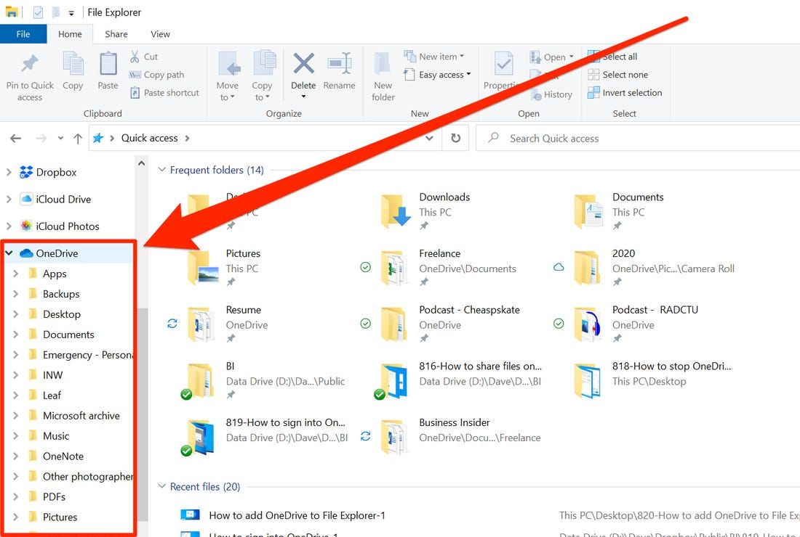
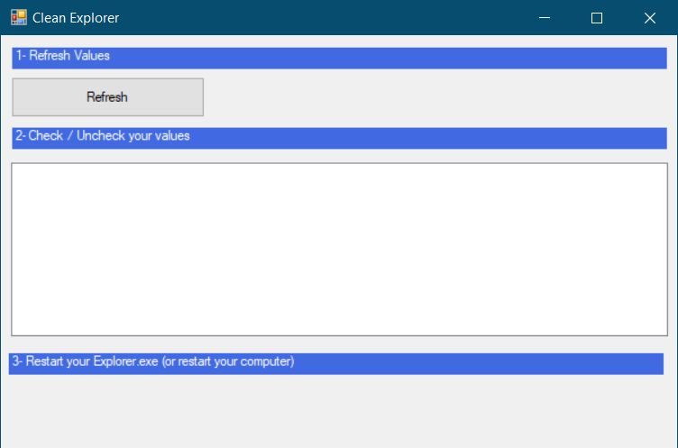
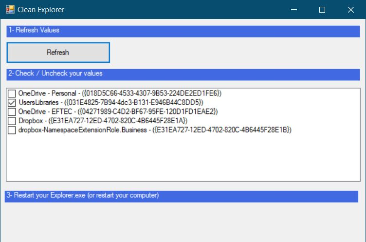

# CleanExplorer
This little application allows to clean the **Windows 10 Explorer** from some products and services such as

* OneDrive
* Dropbox
* Adobe Cloud
* iCloud drive
* And others.

> 🛑 **Note:** This application only hides those programs from the Explorer, they are **not** **un-installed** or they will stop working. Also, you always can turn it back to the original state.

## How it works?

### 1. Download the executables.

First, you must download the correct version depending if your OS is 32 (x86) or 64 bits (x64).  You should download both files

[x64 📁](CleanExplorer/bin/x64/Debug)

[x86 📁](CleanExplorer/bin/x86/Debug)

### 2. Then runs the program.

You must execute it as administrator. 😎

### 3. Then click in the button Refresh. 

It will show all components that have a name

### 4. Then check the component that you want to disable or enable. 

* Checked = enabled (visible).  
* Unchecked = disabled (not visible).  

If you want to turns it back, then check/uncheck it back to the original state.

### 5. And finally, restart Explorer

Or you could restart your computer.

## Note

This application is shared as-is. No warranty. But it should be harmless 😀.  In case of doubt, check the code.

